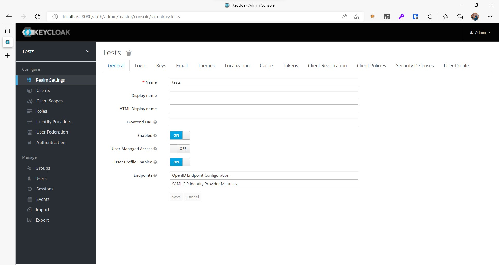
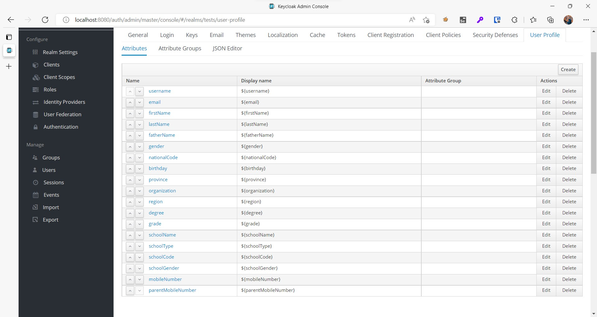
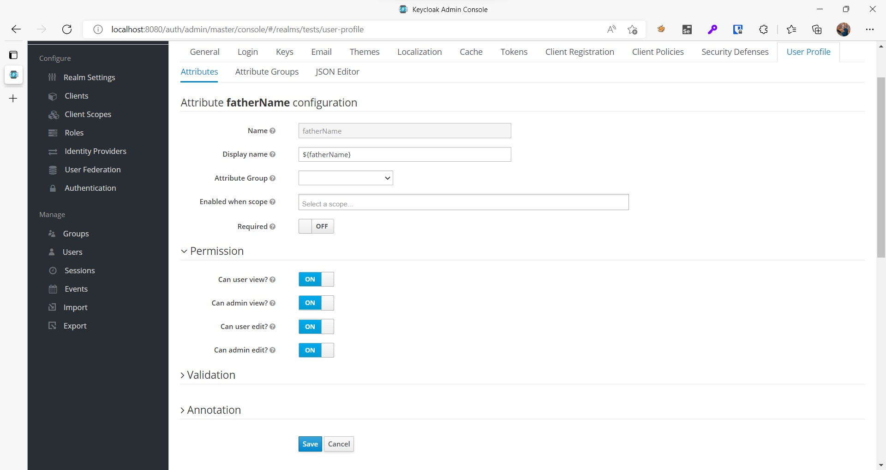
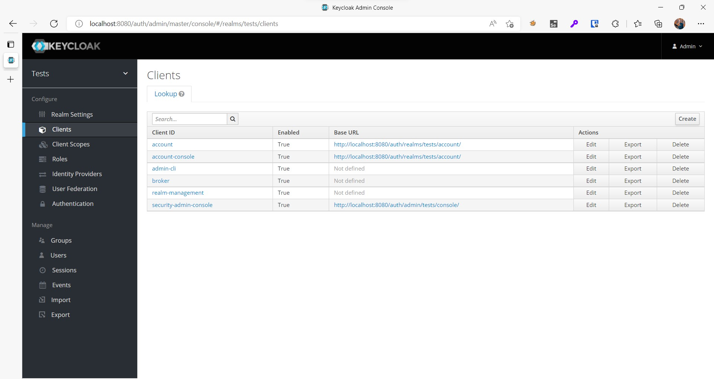
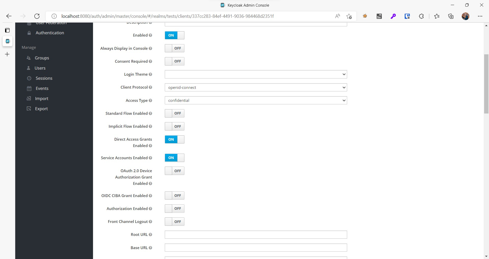
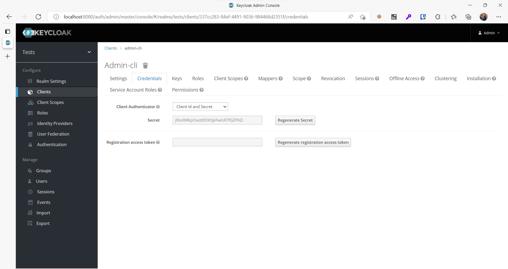
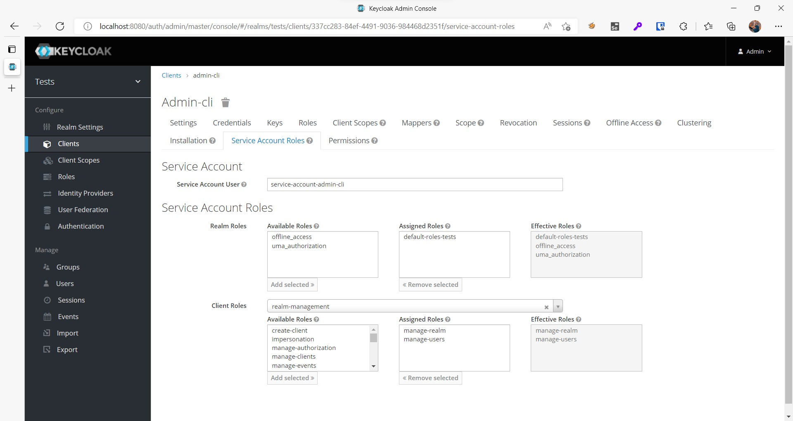

# Welcome to Upload CLI keycloak

## setup

To get you started use this tutorial to configure your keycloak:

https://www.appsdeveloperblog.com/keycloak-rest-api-create-a-new-user/

### enable and config userprofile

Our first step to start is to enable the userprofile feature

If you have turned on the flag related to this feature or added it, you should be able to see the relevant option to activate it in this part like the picture above.

Like the picture below, after saving, you should see the userpofile option at the end of the list.

In this photo, you have four attributes by default, but I created more values for testing, and we will discuss how to create an attribute in the following.

Click on create to start

As you can see, it includes four levels of access, to create values by api, you need to activate edit admin and fill in the values like the picture.

and save after that, now you have created the first attributes prerequisite, of course, if you need it.

### permissions

Now, to use api, we need to get the necessary access.

Follow the photos with the step by step guide.

If you have done the initial configuration, the three photos above are just to complete the steps.

In this section, for example, select realm-management and two accesses, manage-users and manage-realm, the first access is for users api and the second is for partial import api, after giving accesses to realm-management, save the changes And now you can use the written api script.